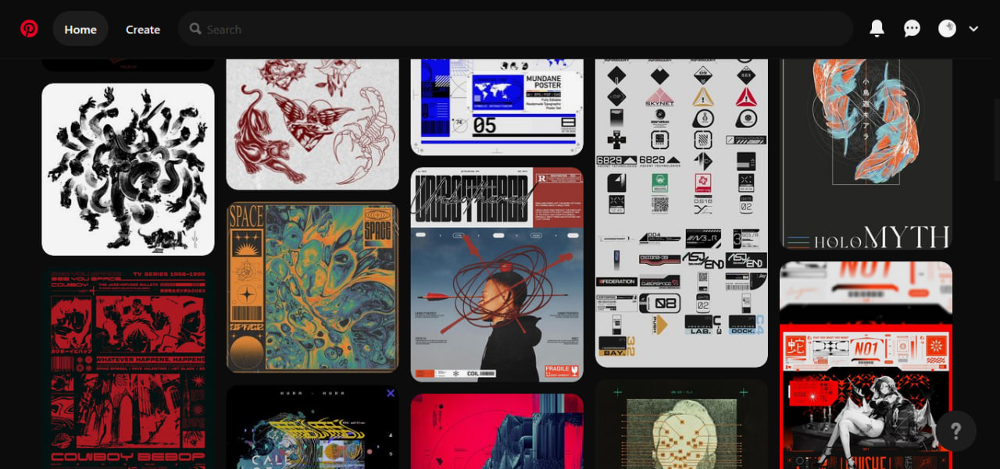
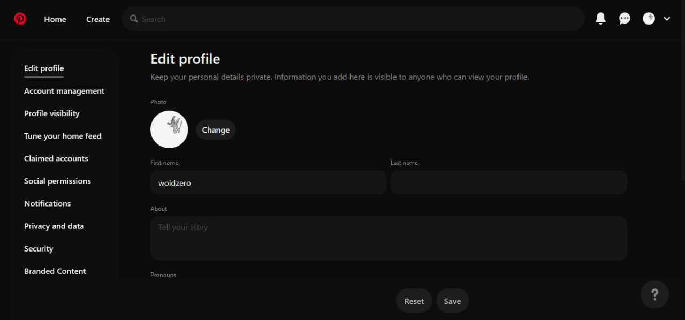
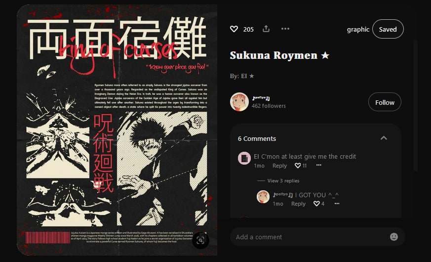
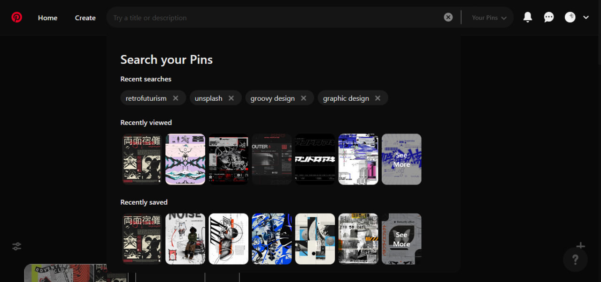

    
# Darkerest

A dark theme for Pinterest + some UI visual improvements.

[![Install through UserStyles.world](https://img.shields.io/badge/dynamic/json?color=%23193652&label=UserStyles.world&query=total_installs&suffix=%20installs&url=https%3A%2F%2Fuserstyles.world%2Fapi%2Fstyle%2Fstats%2F18533&logo=data:image/png;base64,iVBORw0KGgoAAAANSUhEUgAAABAAAAAQCAYAAAAf8/9hAAAACXBIWXMAAAsSAAALEgHS3X78AAADGUlEQVQ4y6WTy29UZRiHn/f7zjkz0+m0nUljOxhKHYo0WpRk6qXEFihuWCDRGFamYSULYyLRuNAlrIxGY1y4UeKiAck0NTECYsQmhXKzDdSmF1o1tJ3UC73NMNO5nPN9Lgr6B/gsfot39Ut+zyuIKJQSAKy1GGP4Dw0oASMQWMCKgLUgAg/zIQJCW1u3Tqf3J3p6utxYrBHP0yUIcmNjWf/y5QsyMXHW5HKrgAuURSUSHfFjr79VGR9f9re2pHYdPvzq1uZm7jQ1UU0mCYKAndPTvKy1vZrLycD1G7Nq4W4u/Gxnw/IHH70nya9O3dBaP5MvbpgjL3Srz1Mpq4IgGBkfl6MNDbKtUGBwyxZqk0nL+jrHl5b0qavXKtFq2XMeS00pMcZUFrOmtmNXpX1qygxkMmxEIs6e9nb9eD6vdtTWqoH+fnVuaEhTX6+fWlmxkZ4eUbFam/v6zJD64403j6qa6Eysqyt8YXqa7zMZCWH5q+KzuHSPS78tkBm9RZDNYlZX+a5cttHtKdcUS5NrX3z5jmOKxRkJh1c0MN/XR3rvXvpvT/DD9Yvc/+xjsAZ5+10yT3Tw4ewdFjo7qQFKiYQHWAcIqYaGOADJJKcbG1krVDj07c+8vzvADyyjv/7EYN9x6jWEq9XN/eLxGBB1AIO1BkBVK0S9EHXhMFeOfcpzQ8Mk8nlG9jxPXIOuVrFaUQLCpYInSkUdILDlctkHKq5HSAQDhBobyWxvRRWLBK3bNkVxHNarhleu9JO7OaLmvIgoICit55ebfxmm7ccz1hj7r1jZdJr57m5MOIw2AQURDo6e48DqHNeefhHEKgVQXFxafPT3MY588pqVuRkeaI0bBHi+jxiDrzSxW7fZd/oEFydnWUm2Otr4jgMQ+nPx/uhLJxjb0etLSysYA9ZiAawB7SGzo8jZk1yavGv93Qe0V1cnRCI1DgDGiAv4O590lFKbt81yYA1WQN2bx+7bz/DJQURBbG2t5u9HmpIC4La0HKzp7T2E72+glQuicF0lWrs8+DlrwKJxHGttqZQNyuVi4fz5b/i//ANWH1Ou13STnwAAAABJRU5ErkJggg==)](https://userstyles.world/style/18533/darkerest)

## Previews

## Installation

To install this style you need a <a href="https://github.com/openstyles/stylus#stylus">Stylus</a> or other userstyle manager.

## License

`darkerest` is distributed under the terms of the [MIT](https://spdx.org/licenses/MIT.html) license.
